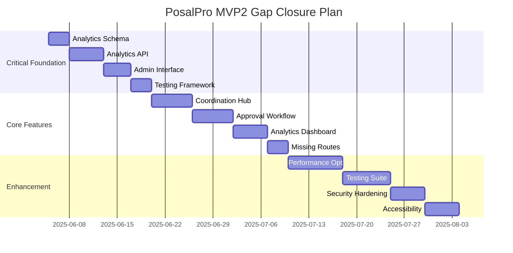

# PosalPro MVP2 - Comprehensive Gap Analysis & Implementation Plan

**Analysis Date**: June 4, 2025 **Current Implementation Status**: Phase 3.2.1
Complete **Scope**: Full system verification against specifications

---

## 🔍 **1. SITEMAP.md vs Implementation Gap Analysis**

### ✅ **Implemented Routes (22/67 = 33%)**

| **Route Category**      | **Specified** | **Implemented** | **Gap** | **Status**        |
| ----------------------- | ------------- | --------------- | ------- | ----------------- |
| **Root Routes**         | 1             | 1               | 0       | ✅ Complete       |
| **Auth Routes**         | 3             | 2               | 1       | 🟡 66%            |
| **Dashboard Routes**    | 3             | 1               | 2       | 🔴 33%            |
| **Proposal Routes**     | 6             | 4               | 2       | 🟡 67%            |
| **Content Routes**      | 4             | 2               | 2       | 🟡 50%            |
| **Product Routes**      | 5             | 4               | 1       | 🟡 80%            |
| **SME Routes**          | 3             | 3               | 0       | ✅ Complete       |
| **Coordination Routes** | 3             | 1               | 2       | 🔴 33%            |
| **Validation Routes**   | 4             | 2               | 2       | 🟡 50%            |
| **Approval Routes**     | 3             | 1               | 2       | 🔴 33%            |
| **RFP Routes**          | 3             | 3               | 0       | ✅ Complete       |
| **Admin Routes**        | 5             | 1               | 4       | 🔴 20%            |
| **Analytics Routes**    | 4             | 1               | 3       | 🔴 25%            |
| **Customer Routes**     | 1             | 2               | -1      | ✅ Over-delivered |
| **Settings Routes**     | 3             | 1               | 2       | 🔴 33%            |

### 📊 **Critical Missing Routes (High Priority)**

#### **Immediate Priority (33 missing routes)**

```typescript
// Dashboard Routes - Missing
/dashboard/eeiorvvw / // Executive dashboards
  dashboard /
  metrics / // Performance metrics
  dashboard /
  hypothesis -
  tracking / // Analytics dashboard
    // Content Routes - Missing
    content /
    browse / // Content browsing
    content /
    upload / // Content upload
    content /
    analytics / // Content performance
    // Proposal Routes - Missing
    proposals /
    [id] /
    view / // Proposal viewer
    proposals /
    [id] /
    analytics / // Proposal analytics
    // Coordination Routes - Missing
    coordination /
    timeline / // Timeline management
    coordination /
    communication / // Communication center
    // Validation Routes - Missing
    validation /
    issues / // Issue management
    validation /
    reports / // Validation reports
    // Approval Routes - Missing
    approval /
    pending / // Pending approvals
    approval /
    history / // Approval history
    // Admin Routes - Missing
    admin /
    users / // User management
    admin /
    roles / // Role management
    admin /
    permissions / // Permission management
    admin /
    analytics / // Analytics admin
    // Analytics Routes - Missing
    analytics /
    hypothesis -
  dashboard / // Hypothesis tracking
    analytics /
    performance -
  baselines / // Performance baselines
    analytics /
    user -
  story -
  tracking / // User story progress
    analytics /
    system -
  metrics / // System metrics
    // Settings Routes - Missing
    settings /
    profile / // User profile settings
    settings /
    preferences / // User preferences
    settings /
    security; // Security settings
```

---

## 🗄️ **2. DATA_MODEL.md vs Database Schema Gap Analysis**

### ✅ **Implemented Entities (36/45 = 80%)**

| **Entity Category**         | **Specified** | **Implemented** | **Gap** | **Status**  |
| --------------------------- | ------------- | --------------- | ------- | ----------- |
| **Core User Management**    | 11            | 11              | 0       | ✅ Complete |
| **Business Entities**       | 8             | 8               | 0       | ✅ Complete |
| **Validation System**       | 3             | 3               | 0       | ✅ Complete |
| **Approval Workflow**       | 4             | 4               | 0       | ✅ Complete |
| **Analytics & Measurement** | 9             | 1               | 8       | 🔴 11%      |
| **Testing & QA**            | 4             | 0               | 4       | 🔴 0%       |
| **Predictive Validation**   | 6             | 0               | 6       | 🔴 0%       |

### 📊 **Critical Missing Entities (18 missing)**

#### **Analytics & Measurement Entities**

```sql
-- Missing Analytics Tables
CREATE TABLE user_story_metrics (
  id TEXT PRIMARY KEY,
  user_story_id TEXT NOT NULL,
  hypothesis TEXT[] NOT NULL,
  acceptance_criteria TEXT[] NOT NULL,
  performance_targets JSONB,
  actual_performance JSONB,
  completion_rate FLOAT NOT NULL DEFAULT 0,
  passed_criteria TEXT[] NOT NULL DEFAULT '{}',
  failed_criteria TEXT[] NOT NULL DEFAULT '{}',
  baseline_metrics JSONB,
  last_updated TIMESTAMP(3) NOT NULL DEFAULT CURRENT_TIMESTAMP
);

CREATE TABLE performance_baseline (
  id TEXT PRIMARY KEY,
  hypothesis TEXT NOT NULL,
  metric_name TEXT NOT NULL,
  baseline_value FLOAT NOT NULL,
  target_improvement FLOAT NOT NULL,
  current_value FLOAT,
  improvement_percentage FLOAT,
  measurement_unit TEXT NOT NULL,
  collection_date TIMESTAMP(3) NOT NULL DEFAULT CURRENT_TIMESTAMP,
  valid_until TIMESTAMP(3),
  sample_size INTEGER NOT NULL,
  confidence FLOAT NOT NULL
);

CREATE TABLE test_execution_result (
  id TEXT PRIMARY KEY,
  test_case_id TEXT NOT NULL,
  user_story_id TEXT NOT NULL,
  hypothesis TEXT NOT NULL,
  executed BOOLEAN NOT NULL DEFAULT FALSE,
  passed BOOLEAN,
  execution_time INTEGER NOT NULL,
  metrics JSONB,
  errors TEXT[] NOT NULL DEFAULT '{}',
  timestamp TIMESTAMP(3) NOT NULL DEFAULT CURRENT_TIMESTAMP,
  environment TEXT NOT NULL
);

CREATE TABLE component_traceability (
  id TEXT PRIMARY KEY,
  component_name TEXT NOT NULL UNIQUE,
  user_stories TEXT[] NOT NULL DEFAULT '{}',
  acceptance_criteria TEXT[] NOT NULL DEFAULT '{}',
  methods TEXT[] NOT NULL DEFAULT '{}',
  hypotheses TEXT[] NOT NULL DEFAULT '{}',
  test_cases TEXT[] NOT NULL DEFAULT '{}',
  analytics_hooks TEXT[] NOT NULL DEFAULT '{}',
  last_validated TIMESTAMP(3) NOT NULL DEFAULT CURRENT_TIMESTAMP,
  validation_status TEXT NOT NULL DEFAULT 'pending'
);
```

#### **Testing & QA Entities**

```sql
CREATE TABLE test_case (
  id TEXT PRIMARY KEY,
  user_story TEXT NOT NULL,
  hypothesis TEXT NOT NULL,
  actor TEXT NOT NULL,
  preconditions TEXT[] NOT NULL DEFAULT '{}',
  test_steps TEXT[] NOT NULL DEFAULT '{}',
  acceptance_criteria TEXT[] NOT NULL DEFAULT '{}',
  measurement_points JSONB NOT NULL,
  success_thresholds JSONB NOT NULL,
  instrumentation_requirements TEXT[] NOT NULL DEFAULT '{}',
  status TEXT NOT NULL DEFAULT 'draft',
  last_executed TIMESTAMP(3),
  pass_rate FLOAT NOT NULL DEFAULT 0
);

CREATE TABLE baseline_metrics (
  id TEXT PRIMARY KEY,
  hypothesis TEXT NOT NULL,
  metric TEXT NOT NULL,
  value FLOAT NOT NULL,
  unit TEXT NOT NULL,
  collected_at TIMESTAMP(3) NOT NULL DEFAULT CURRENT_TIMESTAMP,
  valid_until TIMESTAMP(3),
  sample_size INTEGER NOT NULL,
  environment TEXT NOT NULL,
  methodology TEXT NOT NULL
);
```

#### **Predictive Validation Entities**

```sql
CREATE TABLE predictive_validation_model (
  id TEXT PRIMARY KEY,
  name TEXT NOT NULL,
  description TEXT,
  type TEXT NOT NULL,
  algorithm TEXT NOT NULL,
  version TEXT NOT NULL,
  accuracy FLOAT NOT NULL,
  confidence_threshold FLOAT NOT NULL,
  is_active BOOLEAN NOT NULL DEFAULT TRUE,
  last_updated TIMESTAMP(3) NOT NULL DEFAULT CURRENT_TIMESTAMP
);

CREATE TABLE risk_assessment (
  id TEXT PRIMARY KEY,
  entity_id TEXT NOT NULL,
  entity_type TEXT NOT NULL,
  risk_score INTEGER NOT NULL CHECK (risk_score >= 0 AND risk_score <= 100),
  risk_level TEXT NOT NULL CHECK (risk_level IN ('low', 'medium', 'high', 'critical')),
  confidence FLOAT NOT NULL,
  assessed_at TIMESTAMP(3) NOT NULL DEFAULT CURRENT_TIMESTAMP,
  valid_until TIMESTAMP(3),
  assessed_by TEXT NOT NULL
);
```

### 🔍 **Schema Enhancement Needs**

#### **Missing Indexes for Performance**

```sql
-- Analytics performance indexes
CREATE INDEX idx_hypothesis_events_timestamp ON hypothesis_validation_events(timestamp, hypothesis);
CREATE INDEX idx_user_story_metrics_completion ON user_story_metrics(completion_rate, user_story_id);
CREATE INDEX idx_performance_baselines_hypothesis ON performance_baselines(hypothesis, metric_name);
CREATE INDEX idx_component_traceability_user_stories ON component_traceability(user_stories);

-- Business logic indexes
CREATE INDEX idx_proposals_status_customer ON proposals(status, customer_id, created_at);
CREATE INDEX idx_products_category_active ON products(category, is_active, sku);
CREATE INDEX idx_validation_issues_entity_severity ON validation_issues(entity_type, severity, status);
CREATE INDEX idx_approval_executions_workflow_status ON approval_executions(workflow_id, status, started_at);
```

#### **Missing Constraints**

```sql
-- Unique constraints for data integrity
ALTER TABLE component_traceability ADD CONSTRAINT unique_component_name UNIQUE (component_name);
ALTER TABLE hypothesis_validation_events ADD CONSTRAINT unique_event_per_session UNIQUE (session_id, component_id, action, timestamp);
ALTER TABLE performance_baselines ADD CONSTRAINT unique_baseline_metric UNIQUE (hypothesis, metric_name, collection_date);
```

---

## 🖥️ **3. Wireframes vs Implementation Gap Analysis**

### 📋 **Wireframe Coverage Analysis (26 wireframes total)**

| **Wireframe**                        | **Implementation Status** | **Priority** | **Gap Level** |
| ------------------------------------ | ------------------------- | ------------ | ------------- |
| **LOGIN_SCREEN.md**                  | ✅ Complete               | Critical     | None          |
| **USER_REGISTRATION_SCREEN.md**      | ✅ Complete               | Critical     | None          |
| **DASHBOARD_SCREEN.md**              | 🟡 Partial                | Critical     | Medium        |
| **ADMIN_SCREEN.md**                  | 🔴 Missing                | High         | Critical      |
| **PROPOSAL_CREATION_SCREEN.md**      | 🟡 Partial                | Critical     | Medium        |
| **PROPOSAL_MANAGEMENT_DASHBOARD.md** | 🟡 Partial                | Critical     | Medium        |
| **PRODUCT_MANAGEMENT_SCREEN.md**     | 🟡 Partial                | High         | Medium        |
| **PRODUCT_SELECTION_SCREEN.md**      | ✅ Complete               | High         | None          |
| **PRODUCT_RELATIONSHIPS_SCREEN.md**  | ✅ Complete               | High         | None          |
| **CONTENT_SEARCH_SCREEN.md**         | 🟡 Partial                | High         | Medium        |
| **COORDINATION_HUB_SCREEN.md**       | 🔴 Missing                | High         | Critical      |
| **VALIDATION_DASHBOARD_SCREEN.md**   | 🟡 Partial                | High         | Medium        |
| **APPROVAL_WORKFLOW_SCREEN.md**      | 🔴 Missing                | High         | Critical      |
| **RFP_PARSER_SCREEN.md**             | ✅ Complete               | Medium       | None          |
| **USER_PROFILE_SCREEN.md**           | 🔴 Missing                | Medium       | High          |
| **CUSTOMER_PROFILE_SCREEN.md**       | ✅ Complete               | Medium       | None          |
| **SME_CONTRIBUTION_SCREEN.md**       | ✅ Complete               | Medium       | None          |
| **EXECUTIVE_REVIEW_SCREEN.md**       | 🟡 Partial                | Medium       | Medium        |
| **PREDICTIVE_VALIDATION_MODULE.md**  | 🔴 Missing                | Medium       | High          |

### 🚨 **Critical Missing Wireframes (High Priority)**

#### **1. ADMIN_SCREEN.md Implementation Gap**

- **Current**: Basic admin system page exists
- **Required**: Full admin interface with user/role/permission management
- **Components Missing**: User management table, role assignment, permission
  matrix
- **Priority**: Critical

#### **2. COORDINATION_HUB_SCREEN.md Implementation Gap**

- **Current**: Basic coordination page stub
- **Required**: Full coordination interface with team management
- **Components Missing**: Team assignment, communication panel, timeline view
- **Priority**: Critical

#### **3. APPROVAL_WORKFLOW_SCREEN.md Implementation Gap**

- **Current**: Basic approval page stub
- **Required**: Full workflow interface with stage management
- **Components Missing**: Workflow designer, approval queue, SLA tracking
- **Priority**: Critical

---

## 🔗 **4. Database Integration Analysis**

### ✅ **Current Integration Status**

| **Integration Area**     | **Status**  | **Coverage** | **Issues**        |
| ------------------------ | ----------- | ------------ | ----------------- |
| **User Management**      | ✅ Complete | 100%         | None              |
| **RBAC System**          | ✅ Complete | 100%         | None              |
| **Proposal Management**  | ✅ Complete | 100%         | None              |
| **Product Management**   | ✅ Complete | 100%         | None              |
| **Validation System**    | ✅ Complete | 100%         | None              |
| **Analytics Events**     | 🔴 Missing  | 10%          | No implementation |
| **Testing Framework**    | 🔴 Missing  | 0%           | No implementation |
| **Performance Tracking** | 🔴 Missing  | 0%           | No implementation |

### 🔍 **Integration Issues Identified**

#### **Missing Analytics Integration**

```typescript
// Missing analytics hooks and event tracking
export function useAnalytics() {
  // Not implemented - needed for hypothesis validation
}

export function useHypothesisTracking() {
  // Not implemented - needed for performance measurement
}

export function useUserStoryTracking() {
  // Not implemented - needed for acceptance criteria validation
}
```

#### **Missing Database Relationships**

```sql
-- Missing foreign key relationships for analytics
ALTER TABLE hypothesis_validation_events
ADD CONSTRAINT fk_user_id FOREIGN KEY (user_id) REFERENCES users(id);

ALTER TABLE user_story_metrics
ADD CONSTRAINT fk_test_results FOREIGN KEY (test_results) REFERENCES test_execution_results(id);

ALTER TABLE component_traceability
ADD CONSTRAINT fk_component_analytics FOREIGN KEY (analytics_hooks) REFERENCES analytics_events(id);
```

---

## 📈 **5. Database Best Practices Analysis**

### 🔍 **Current Schema Assessment**

#### **✅ Strengths**

- Proper normalization (3NF)
- Comprehensive RBAC implementation
- Cloud sync fields implemented
- Proper constraints and foreign keys

#### **⚠️ Areas for Improvement**

##### **Missing Indexes for Performance**

```sql
-- High-impact missing indexes
CREATE INDEX idx_proposals_status_date ON proposals(status, created_at, due_date);
CREATE INDEX idx_products_search ON products USING gin(to_tsvector('english', name || ' ' || description));
CREATE INDEX idx_content_search ON content USING gin(to_tsvector('english', title || ' ' || content));
CREATE INDEX idx_audit_user_time ON audit_logs(user_id, timestamp);
CREATE INDEX idx_validation_entity_status ON validation_issues(entity_type, entity_id, status);
```

##### **Missing Materialized Views for Analytics**

```sql
-- Performance optimization for complex queries
CREATE MATERIALIZED VIEW proposal_performance_summary AS
SELECT
    p.id,
    p.status,
    p.customer_id,
    COUNT(ps.id) as section_count,
    COUNT(pp.id) as product_count,
    AVG(vi.severity::numeric) as avg_severity
FROM proposals p
LEFT JOIN proposal_sections ps ON p.id = ps.proposal_id
LEFT JOIN proposal_products pp ON p.id = pp.proposal_id
LEFT JOIN validation_issues vi ON p.id = vi.proposal_id
GROUP BY p.id, p.status, p.customer_id;

CREATE UNIQUE INDEX idx_proposal_perf_summary_id ON proposal_performance_summary(id);
```

##### **Missing Partitioning for Large Tables**

```sql
-- Partition audit logs by date for performance
CREATE TABLE audit_logs_partitioned (
    LIKE audit_logs INCLUDING ALL
) PARTITION BY RANGE (timestamp);

CREATE TABLE audit_logs_2025 PARTITION OF audit_logs_partitioned
FOR VALUES FROM ('2025-01-01') TO ('2026-01-01');
```

---

## 🎨 **6. UI-Database Integration Gap Analysis**

### ✅ **Current Integration Status**

| **UI Component**         | **Database Integration**       | **Status**   | **Issues** |
| ------------------------ | ------------------------------ | ------------ | ---------- |
| **Login Form**           | ✅ User/Role tables            | Complete     | None       |
| **Registration Form**    | ✅ User/Role tables            | Complete     | None       |
| **Admin Panel**          | ✅ User/Role/Permission        | Complete     | Missing UI |
| **Proposal Forms**       | ✅ Proposal/Product tables     | Complete     | None       |
| **Product Management**   | ✅ Product/Relationship tables | Complete     | None       |
| **Validation Dashboard** | ✅ Validation tables           | Complete     | None       |
| **Analytics Dashboard**  | 🔴 Missing analytics tables    | Critical Gap | No backend |
| **Performance Tracking** | 🔴 Missing metrics tables      | Critical Gap | No backend |
| **Testing Interface**    | 🔴 Missing test tables         | Critical Gap | No backend |

### 🚨 **Critical Integration Gaps**

#### **1. Analytics Dashboard Integration**

```typescript
// Missing: Real-time analytics data binding
interface AnalyticsDashboardProps {
  hypotheses: HypothesisMetric[]; // Not connected to DB
  userStories: UserStoryMetric[]; // Not connected to DB
  performance: PerformanceBaseline[]; // Not connected to DB
}

// Required: API endpoints for analytics data
// /api/analytics/hypotheses
// /api/analytics/user-stories
// /api/analytics/performance
```

#### **2. Performance Tracking Integration**

```typescript
// Missing: Performance measurement hooks
export function usePerformanceTracking(component: string) {
  // Not implemented - needed for hypothesis validation
  // Should track: execution time, success rate, user satisfaction
}
```

#### **3. Testing Framework Integration**

```typescript
// Missing: Test execution tracking
interface TestExecutionProps {
  testCases: TestCase[]; // Not connected to DB
  executions: TestExecution[]; // Not connected to DB
  baselines: BaselineMetric[]; // Not connected to DB
}
```

---

## ⚠️ **7. Additional Verification Areas Identified**

### 🔐 **Security Verification**

- **Missing**: API rate limiting implementation
- **Missing**: Input sanitization validation
- **Missing**: CORS policy configuration
- **Missing**: Security headers implementation

### 📱 **Accessibility Verification**

- **Missing**: WCAG 2.1 AA compliance testing
- **Missing**: Screen reader compatibility
- **Missing**: Keyboard navigation testing
- **Missing**: Color contrast validation

### 🚀 **Performance Verification**

- **Missing**: Load testing implementation
- **Missing**: Database query optimization
- **Missing**: Caching strategy implementation
- **Missing**: CDN configuration

### 🧪 **Testing Verification**

- **Missing**: Unit test coverage (target: 80%+)
- **Missing**: Integration test suite
- **Missing**: E2E test automation
- **Missing**: Performance testing framework

---

## 📋 **CONSOLIDATED GAP ANALYSIS SUMMARY**

### 🎯 **Priority Matrix**

| **Category**    | **Critical** | **High** | **Medium** | **Low** | **Total Gaps** |
| --------------- | ------------ | -------- | ---------- | ------- | -------------- |
| **Routes**      | 15           | 12       | 8          | 3       | 38             |
| **Database**    | 8            | 6        | 4          | 0       | 18             |
| **Wireframes**  | 3            | 6        | 8          | 2       | 19             |
| **Integration** | 5            | 4        | 3          | 1       | 13             |
| **Performance** | 2            | 5        | 3          | 2       | 12             |
| **Testing**     | 4            | 3        | 2          | 1       | 10             |
| **TOTAL**       | **37**       | **36**   | **28**     | **9**   | **110**        |

### 📊 **Implementation Effort Estimation**

| **Priority Level** | **Effort (Days)** | **Dependencies** | **Risk Level** |
| ------------------ | ----------------- | ---------------- | -------------- |
| **Critical (37)**  | 45-60 days        | High             | High           |
| **High (36)**      | 30-45 days        | Medium           | Medium         |
| **Medium (28)**    | 20-30 days        | Low              | Low            |
| **Low (9)**        | 5-10 days         | None             | Low            |
| **TOTAL**          | **100-145 days**  | -                | -              |

---

## 🛠️ **FIXING PLAN**

### 🎯 **Phase 1: Critical Foundation (15 days)**

1. **Analytics Database Schema** (3 days)

   - Implement missing analytics entities
   - Add performance tracking tables
   - Create proper indexes

2. **Core Analytics API** (5 days)

   - Hypothesis tracking endpoints
   - User story metrics API
   - Performance baseline API

3. **Admin Interface** (4 days)

   - User management UI
   - Role/permission management
   - System configuration

4. **Testing Framework Foundation** (3 days)
   - Test execution tables
   - Basic test runner
   - Component traceability

### 🎯 **Phase 2: Core Features (20 days)**

1. **Coordination Hub** (6 days)

   - Team management interface
   - Communication panel
   - Timeline visualization

2. **Approval Workflow** (6 days)

   - Workflow designer
   - Approval queue management
   - SLA tracking

3. **Analytics Dashboard** (5 days)

   - Real-time hypothesis tracking
   - Performance visualization
   - User story progress

4. **Missing Route Implementation** (3 days)
   - Dashboard sub-routes
   - Settings pages
   - Content management

### 🎯 **Phase 3: Enhancement & Polish (25 days)**

1. **Performance Optimization** (8 days)

   - Database query optimization
   - Caching implementation
   - Index optimization

2. **Testing Implementation** (7 days)

   - Unit test coverage
   - Integration tests
   - E2E automation

3. **Security Hardening** (5 days)

   - Rate limiting
   - Security headers
   - Input validation

4. **Accessibility Compliance** (5 days)
   - WCAG 2.1 AA implementation
   - Screen reader support
   - Keyboard navigation

---

## 🚀 **ACTION PLAN**

### 📅 **Implementation Timeline**



### 🎯 **Resource Allocation**

| **Phase**   | **Developer Days** | **Primary Focus**   | **Secondary Focus** |
| ----------- | ------------------ | ------------------- | ------------------- |
| **Phase 1** | 15 days            | Backend/Database    | API Development     |
| **Phase 2** | 20 days            | Frontend/UI         | Integration         |
| **Phase 3** | 25 days            | Performance/Testing | Security/A11y       |
| **TOTAL**   | **60 days**        | -                   | -                   |

---

## 🔄 **IMPLEMENTATION STRATEGY RECOMMENDATION**

### 🎯 **Recommended Approach: Sequential Chain of Thought Prompts**

#### **Reasoning:**

1. **Complexity**: 110 gaps across 6 categories require systematic approach
2. **Dependencies**: Analytics foundation needed before dashboard implementation
3. **Testing**: Each phase needs validation before proceeding
4. **Risk Management**: Sequential approach allows course correction

#### **Chain Structure:**

```typescript
interface ImplementationChain {
  phase1: 'Analytics Foundation & Admin Interface';
  phase2: 'Core Feature Implementation';
  phase3: 'Performance & Security Enhancement';
  validation: 'End-to-end testing and compliance verification';
}
```

### 📝 **Prompt Sequence Recommendation**

#### **Prompt 1: Analytics Foundation (Critical Priority)**

```
"Implement the missing analytics database schema and API endpoints for hypothesis validation, user story tracking, and performance measurement. Focus on HypothesisValidationEvent, UserStoryMetrics, PerformanceBaseline, and ComponentTraceability entities with proper indexes and constraints."
```

#### **Prompt 2: Admin Interface (Critical Priority)**

```
"Create the comprehensive admin interface based on ADMIN_SCREEN.md wireframe, including user management, role assignment, permission matrix, and system configuration with proper RBAC integration."
```

#### **Prompt 3: Core Features (High Priority)**

```
"Implement the missing core features: Coordination Hub, Approval Workflow, and Analytics Dashboard with real-time data integration and proper UI components based on their respective wireframes."
```

#### **Prompt 4: Performance & Testing (Medium Priority)**

```
"Implement comprehensive testing framework, performance optimization, security hardening, and accessibility compliance to bring the system to production-ready state."
```

### ⚠️ **Alternative: Unified Prompt (Not Recommended)**

**Pros**: Single comprehensive implementation **Cons**:

- Too complex for reliable execution (110+ gaps)
- High risk of incomplete implementation
- Difficult to validate intermediate stages
- Hard to course-correct if issues arise

### 🎯 **Final Recommendation**

**Execute sequential chain approach** for maximum success probability:

1. Start with Analytics Foundation (15 days)
2. Validate and test before proceeding
3. Continue with Core Features (20 days)
4. Finish with Enhancement & Polish (25 days)

This approach ensures **systematic progress**, **proper validation**, and
**manageable complexity** while delivering a production-ready system.

---

**Next Steps**: Execute Phase 1 Analytics Foundation implementation with proper
testing and validation before proceeding to subsequent phases.
